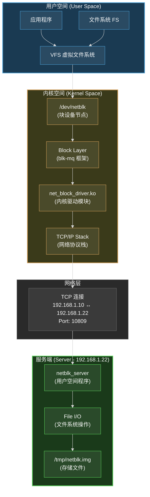
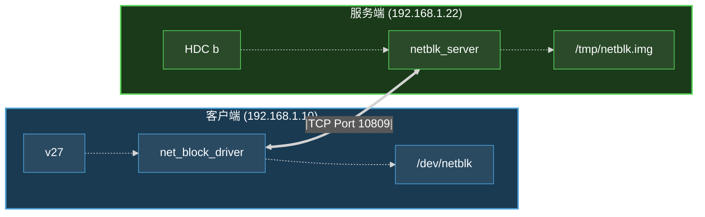

# Network Block Device Driver - 完整文档

> 一个基于 TCP/IP 网络的 Linux 内核块设备驱动，可以通过网络访问远程存储服务器，类似于 NBD (Network Block Device) 但协议更简单、易于定制。

## 📋 目录

- [功能特性](#功能特性)
- [系统架构](#系统架构)
- [快速开始](#快速开始)
- [使用手册](#使用手册)
- [网络协议](#网络协议)
- [性能测试](#性能测试)
- [高级配置](#高级配置)
- [内核机制详解](#内核机制详解)
- [开发参考](#开发参考)

---

## 🎯 功能特性

### 核心功能
- ✅ **TCP/IP 网络通信** - 基于可靠的 TCP 协议
- ✅ **读写操作** - 完整支持块设备读写操作
- ✅ **自动重连机制** - 网络断开自动重试（最多 3 次）
- ✅ **Sysfs 配置接口** - 运行时动态配置
- ✅ **统计信息** - 实时监控读写字节数、错误数
- ✅ **blk-mq 框架** - 使用现代多队列块设备框架

### 高级特性
- 🔄 **连接管理** - 支持手动连接/断开
- 📊 **实时监控** - 通过 sysfs 查看状态和统计
- ⚡ **性能优化** - 支持请求合并、队列深度可调
- 🛡️ **错误处理** - 完善的超时和重试机制
- 🎛️ **运行时配置** - 无需重启即可修改服务器地址

---

## 🏗️ 系统架构

### 整体架构



### 网络拓扑



---

## 🚀 快速开始


```bash
# 1. 编译项目
cd /home/huaizhenlv/linux_arm_driver
./build.sh

# 2. 启动服务端
scp build/output/netblk_server b:/userdata/netblk/

./netblk_server 10809 /tmp/netblk_storage.img 100

# 3. 加载驱动
scp build/output/net_block_driver.ko zx:/userdata/netblk/

insmod net_block_driver.ko

# 4. 验证连接
cat /sys/block/netblk/state  # 应显示 "connected"

# 5. 使用块设备
mkfs.ext4 /dev/netblk
mkdir -p /mnt/netblk
mount /dev/netblk /mnt/netblk
echo "Hello Network Block Device!" > /mnt/netblk/test.txt
cat /mnt/netblk/test.txt
```

---

## 📖 使用手册

### 基本操作

#### 1. 格式化块设备

```bash
# 格式化为 ext4 文件系统
mkfs.ext4 /dev/netblk

# 或格式化为其他文件系统
mkfs.xfs /dev/netblk
mkfs.btrfs /dev/netblk
```

#### 2. 挂载和使用

```bash
# 创建挂载点
mkdir -p /mnt/netblk

# 挂载
mount /dev/netblk /mnt/netblk

# 验证挂载
df -h | grep netblk
mount | grep netblk

# 写入数据
echo "Hello Network Block Device!" > /mnt/netblk/test.txt
dd if=/dev/urandom of=/mnt/netblk/largefile bs=1M count=10

# 读取数据
cat /mnt/netblk/test.txt
ls -lh /mnt/netblk/

# 同步数据到磁盘
sync
```

#### 3. 卸载

```bash
# 1. 卸载文件系统
umount /mnt/netblk

# 2. 断开网络连接（可选）
echo "1" > /sys/block/netblk/disconnect

# 3. 卸载驱动模块
rmmod net_block_driver

# 4. 在服务端停止服务器
# 按 Ctrl+C 或
pkill netblk_server
```

### Sysfs 配置接口

所有配置都可以通过 sysfs 动态调整：

```bash
/sys/block/netblk/
├── server_ip       # 读写：服务器 IP 地址
├── server_port     # 读写：服务器端口
├── state           # 只读：连接状态
├── stats           # 只读：统计信息
├── connect         # 只写：手动连接（写入 1）
└── disconnect      # 只写：手动断开（写入 1）
```

#### 查看状态

```bash
# 服务器 IP
cat /sys/block/netblk/server_ip

# 服务器端口
cat /sys/block/netblk/server_port

# 连接状态
cat /sys/block/netblk/state
# 可能的值：disconnected, connecting, connected, error

# 统计信息
cat /sys/block/netblk/stats
# 输出示例：
# read_bytes:  10485760
# write_bytes: 20971520
# errors:      0
```

#### 控制连接

```bash
# 断开连接
echo "1" > /sys/block/netblk/disconnect

# 重新连接
echo "1" > /sys/block/netblk/connect

# 修改服务器地址
echo "192.168.1.100" > /sys/block/netblk/server_ip
echo "20000" > /sys/block/netblk/server_port
```

---

## 🌐 网络协议

### 协议格式

#### 请求包（客户端 → 服务端）

```
+------+--------+--------+------+
| CMD  | SECTOR | LENGTH | DATA |
+------+--------+--------+------+
  1B      8B       4B     变长
```

- **CMD**: 命令类型 (1 字节)
  - `0x01` - READ (读取)
  - `0x02` - WRITE (写入)
  - `0x03` - DISCONNECT (断开连接)
- **SECTOR**: 扇区号，大端序 (8 字节)
- **LENGTH**: 数据长度（字节），大端序 (4 字节)
- **DATA**: 数据内容（仅 WRITE 命令包含）

#### 响应包（服务端 → 客户端）

```
+--------+------+
| STATUS | DATA |
+--------+------+
   1B     变长
```

- **STATUS**: 状态码 (1 字节)
  - `0x00` - OK (成功)
  - `0x01` - ERROR (错误)
- **DATA**: 数据内容（仅 READ 命令成功时包含）

### 通信流程

#### 读操作流程

```
客户端 → 服务端: [0x01][sector][length]
         ↓
    服务端读取存储文件
         ↓
客户端 ← 服务端: [0x00][data]
```

#### 写操作流程

```
客户端 → 服务端: [0x02][sector][length][data]
         ↓
    服务端写入存储文件
         ↓
客户端 ← 服务端: [0x00]
```

#### 断开流程

```
客户端 → 服务端: [0x03][0][0]
         ↓
    服务端关闭连接
```

### 错误处理

- **网络超时**: 5 秒发送/接收超时
- **自动重试**: 失败后自动重试最多 3 次
- **连接断开**: 自动尝试重新连接
- **错误日志**: 所有错误记录到内核日志 (dmesg)

---

## 📊 性能测试

### 基本性能测试

#### 写入性能测试

```bash
# 顺序写入测试
dd if=/dev/zero of=/mnt/netblk/perftest bs=1M count=100 oflag=direct

# 输出示例：
# 104857600 bytes (105 MB, 100 MiB) copied, 5.2 s, 20.2 MB/s
```

#### 读取性能测试

```bash
# 清除缓存
echo 3 > /proc/sys/vm/drop_caches

# 顺序读取测试
dd if=/mnt/netblk/perftest of=/dev/null bs=1M iflag=direct

# 输出示例：
# 104857600 bytes (105 MB, 100 MiB) copied, 4.8 s, 21.8 MB/s
```

---

## ⚙️ 高级配置

### 修改设备大小

在驱动源码 `net_block_driver.c` 中修改：

```c
#define NETBLK_DEFAULT_SIZE (100 * 1024 * 1024)  // 改为所需大小
```

重新编译并加载驱动。

### 修改重试次数和超时

```c
#define MAX_RETRIES 3           // 最大重试次数
#define CONNECT_TIMEOUT 5000    // 连接超时（毫秒）
```

### 调整队列深度

```c
netblk_dev->tag_set.queue_depth = 128;  // 改为所需值（如 256）
```

### 使用不同的端口

```bash
# 启动服务器时指定不同端口
./netblk_server 20000 /tmp/netblk.img 100

# 客户端配置
echo "20000" > /sys/block/netblk/server_port
echo "1" > /sys/block/netblk/connect
```

### 多个块设备

目前驱动只支持单个块设备。如需多个设备，需要修改驱动代码：

1. 将 `netblk_device` 改为数组或链表
2. 为每个设备分配不同的 minor 号
3. 修改 gendisk 注册逻辑

## 内核机制详解

### 文件操作表设置与调用机制

#### 1. 块设备文件操作表的设置过程

在 Linux 内核中，块设备使用 `block_device_operations` 结构体定义设备的操作函数，这是 VFS（虚拟文件系统）实现多态性的关键机制。

##### 定义设备操作表

```c
// 在 net_block_driver.c 第 494 行定义
static const struct block_device_operations netblk_fops = {
    .owner = THIS_MODULE,
    .open = netblk_open,
    .release = netblk_release,
    .getgeo = netblk_getgeo,
};
```

##### 绑定到 gendisk

```c
// 在 netblk_init() 函数中，约 735 行
netblk_dev->gd->fops = &netblk_fops;  // 建立操作表关联
netblk_dev->gd->private_data = netblk_dev;
```

#### 2. VFS 层的文件操作表传递机制

当用户空间程序打开块设备文件时，会经历以下过程：

##### 核心代码分析

```c
// VFS 层在 do_dentry_open() 中执行
f->f_op = fops_get(inode->i_fop);
```

**这行代码的作用：**
1. 从 inode 获取文件操作表：`inode->i_fop`
2. 增加模块引用计数：`fops_get()` 防止模块被卸载
3. 赋值给 file 结构：将操作表指针赋给打开的文件对象 `f->f_op`

##### 完整调用链路

```
用户空间: open("/dev/netblk", O_RDWR)
    ↓
sys_open()                          # 系统调用入口
    ↓
do_sys_open()                       # 打开文件的核心实现
    ↓
do_filp_open()                      # 路径查找和文件打开
    ↓
path_openat()                       # 路径解析
    ↓
do_dentry_open()                    # 执行 f->f_op = fops_get(inode->i_fop)
    ↓
f->f_op->open()                     # 调用块设备的 open 函数
    ↓
blkdev_open()                       # 通用块设备打开函数
    ↓
disk->fops->open()                  # 调用设备特定的 open
    ↓
netblk_open()                       # 最终调用我们的驱动函数
```

#### 3. 块设备的两级操作表机制

块设备使用**两级文件操作表**设计：

```
第一级：def_blk_fops (通用块设备操作表)
    ├─ open         = blkdev_open()
    ├─ release      = blkdev_release()
    ├─ read_iter    = blkdev_read_iter()
    ├─ write_iter   = blkdev_write_iter()
    └─ llseek       = block_llseek()
    
第二级：netblk_fops (设备特定操作表)
    ├─ owner        = THIS_MODULE
    ├─ open         = netblk_open()
    ├─ release      = netblk_release()
    └─ getgeo       = netblk_getgeo()
```

##### inode 中的文件操作表来源

```c
// 在内核 fs/block_dev.c 中定义
static const struct file_operations def_blk_fops = {
    .open           = blkdev_open,
    .release        = blkdev_release,
    .llseek         = block_llseek,
    .read_iter      = blkdev_read_iter,
    .write_iter     = blkdev_write_iter,
    .iopoll         = blkdev_iopoll,
    .fsync          = blkdev_fsync,
    // ...
};

// 块设备的 inode 在创建时：
inode->i_fop = &def_blk_fops;  // 指向通用块设备操作表
```

#### 4. 实际执行流程详解

##### 打开设备的完整过程

```c
// 步骤 1: 用户空间调用
int fd = open("/dev/netblk", O_RDWR);

// 步骤 2: VFS 层获取文件操作表
// 在 do_dentry_open() 中：
f->f_op = fops_get(inode->i_fop);  
// 此时 f->f_op = &def_blk_fops (通用块设备操作表)

// 步骤 3: 调用通用块设备的 open
f->f_op->open(inode, file);  
// 实际调用 blkdev_open()

// 步骤 4: blkdev_open() 内部查找 gendisk
static int blkdev_open(struct inode *inode, struct file *filp)
{
    struct block_device *bdev;
    struct gendisk *disk;
    int ret;
    
    // 获取块设备结构
    bdev = blkdev_get_by_dev(inode->i_rdev, filp->f_mode, filp);
    
    // 获取 gendisk
    disk = bdev->bd_disk;  // 这是我们注册的 gendisk
    
    // 调用设备特定的 open 函数
    if (disk->fops->open) {
        ret = disk->fops->open(bdev, filp->f_mode);
        // ↑ 这里调用 netblk_fops->open，即 netblk_open()
    }
    
    return ret;
}

// 步骤 5: 执行我们的驱动函数
static int netblk_open(struct block_device *bdev, fmode_t mode)
{
    struct netblk_device *dev = bdev->bd_disk->private_data;
    pr_info("netblk: Device opened\n");
    return 0;
}
```

#### 5. 关键数据结构关系

```
用户空间文件描述符: fd = 3
    ↓
VFS 层: struct file
    ├─ f_op = &def_blk_fops          (从 inode->i_fop 复制)
    ├─ f_mode = FMODE_READ|FMODE_WRITE
    └─ f_inode
           ├─ i_fop = &def_blk_fops   (通用块设备操作表)
           └─ i_bdev (struct block_device)
                  └─ bd_disk (struct gendisk)
                         ├─ fops = &netblk_fops  (我们的操作表)
                         ├─ private_data = netblk_dev
                         └─ queue (request_queue)
```

#### 6. I/O 请求处理路径

**注意**：实际的读写操作并不通过 `fops`，而是通过 blk-mq 机制：

```
用户空间: read(fd, buf, size) / write(fd, buf, size)
    ↓
VFS: vfs_read() / vfs_write()
    ↓
def_blk_fops.read_iter / write_iter
    ↓
Block Layer (通用块层)
    ↓
blk-mq (多队列块设备框架)
    ↓
netblk_queue_rq()                    # 我们定义的队列操作
    ↓
netblk_request()                     # 请求处理函数
    ↓
netblk_net_read() / netblk_net_write()  # 网络传输
    ↓
TCP/IP 协议栈
    ↓
网络 → 服务器
```

#### 7. 为什么需要两级操作表？

**设计目的：**

1. **统一接口**
   - 所有块设备对外都使用 `def_blk_fops`
   - 用户空间程序无需关心底层设备类型
   - VFS 层统一处理缓存、权限检查等

2. **设备特定操作**
   - 通过 `gendisk->fops` 调用设备特定的 `open/release/getgeo`
   - 允许驱动实现自定义行为
   - 保持灵活性和可扩展性

3. **模块引用管理**
   - `fops_get()` 自动增加模块引用计数
   - 确保驱动模块在使用时不会被卸载
   - `fops_put()` 在关闭时减少引用计数

4. **I/O 路径优化**
   - 读写操作通过 blk-mq 框架处理（更高效）
   - `fops` 只处理管理操作（open/close/ioctl）
   - 分离控制路径和数据路径

#### 8. 代码追踪示例

如果想在内核中追踪这个过程，可以添加以下调试代码：

```c
// 在 netblk_open() 中添加
static int netblk_open(struct block_device *bdev, fmode_t mode)
{
    struct netblk_device *dev = bdev->bd_disk->private_data;
    
    pr_info("=== netblk_open called ===\n");
    pr_info("gendisk: %p\n", bdev->bd_disk);
    pr_info("gendisk->fops: %p\n", bdev->bd_disk->fops);
    pr_info("Expected fops: %p\n", &netblk_fops);
    pr_info("private_data: %p\n", dev);
    
    return 0;
}
```

查看调用栈：

```bash
# 在客户端执行
echo t > /proc/sysrq-trigger  # 触发任务栈转储

# 查看内核日志
dmesg | grep -A 20 "netblk_open"
```

---

## 📚 开发参考

### 扩展方向

#### 1. 安全性增强
- [ ] TLS/SSL 加密传输
- [ ] 认证机制（用户名/密码）
- [ ] 访问控制列表 (ACL)
- [ ] 数据加密（AES-256）

#### 2. 性能优化
- [ ] 异步 I/O 支持
- [ ] 批量请求合并
- [ ] 数据压缩（LZ4/ZSTD）
- [ ] 零拷贝优化
- [ ] 多路径支持

#### 3. 可靠性提升
- [ ] 数据校验（CRC32/MD5）
- [ ] 自动故障转移
- [ ] 心跳检测
- [ ] 断点续传
- [ ] 写入日志 (Write-Ahead Log)

#### 4. 功能扩展
- [ ] 快照支持
- [ ] 精简配置 (Thin Provisioning)
- [ ] QoS 限速
- [ ] 统计信息导出 (Prometheus)
- [ ] 多设备支持


### 主要函数说明

#### 驱动核心函数

- `netblk_init()` - 驱动初始化
- `netblk_exit()` - 驱动退出
- `netblk_request()` - blk-mq 请求处理
- `netblk_connect()` - 连接服务器
- `netblk_disconnect()` - 断开连接
- `netblk_net_read()` - 网络读操作
- `netblk_net_write()` - 网络写操作

#### 服务端核心函数

- `handle_client()` - 客户端连接处理
- `handle_read()` - 读请求处理
- `handle_write()` - 写请求处理
- `recv_all()` - 完整接收数据
- `send_all()` - 完整发送数据

### 配置参数

| 参数 | 默认值 | 位置 | 说明 |
|------|--------|------|------|
| NETBLK_DEFAULT_SIZE | 100MB | net_block_driver.c | 设备大小 |
| NETBLK_SECTOR_SIZE | 512 | net_block_driver.c | 扇区大小 |
| MAX_RETRIES | 3 | net_block_driver.c | 最大重试次数 |
| CONNECT_TIMEOUT | 5000 | net_block_driver.c | 连接超时(ms) |
| queue_depth | 128 | net_block_driver.c | 队列深度 |
| server_ip | 192.168.1.22 | 运行时配置 | 服务器IP |
| server_port | 10809 | 运行时配置 | 服务器端口 |

### 限制和已知问题

1. **单设备限制** - 目前只支持单个块设备实例
2. **网络延迟** - 网络延迟直接影响 I/O 性能
3. **无加密** - 协议未加密，不适合公网传输
4. **无认证** - 没有连接认证机制
5. **单客户端** - 服务端同时只能服务一个客户端

---

## 📝 许可证

本项目采用 GPL 许可证。详见源代码文件头部。

---

**版本**: 1.0  
**最后更新**: 2025-11-05
